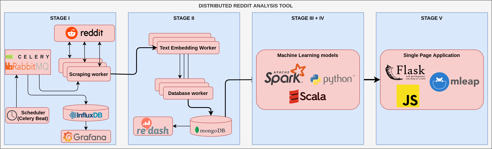

# large-scale-data-processing

The repository contains results of Large Scale Data Processing course at Wroclaw Univ. of Science and Technology. Main goal of laboratories was implementation of distributed reddit analysis tool with given architecture:

## Laboratories scopes

### Lab 1
- Linux - bash, ssh, scp, tmux, htop, kill, killall, pipe operator, ls, sed, vim, cat
- Docker - Dockerfile, docker-compose, containers in general
- Python - pip, virtualenv, requirements, tox
- Parallelize computation in Python

### Lab 2
- Celery
- Task queue (RabbitMQ)
- System monitoring (Prometheus, InfluxDB)
- Reddit API usage

### Lab 3
- Text embedding (magnitude library)
- Data persistency (MongoDB)
- Data analysis (Redash)

### Lab 4
- pySpark
- Linear regression
- Binary classification
- Multi-class classification

### Lab 5
- Kubernetes
- K3s
- Helm
- Docker
- Application deployment (AWS)

### Lab 6
- Serving
- API (Flask)
- SPA (Streamlit)